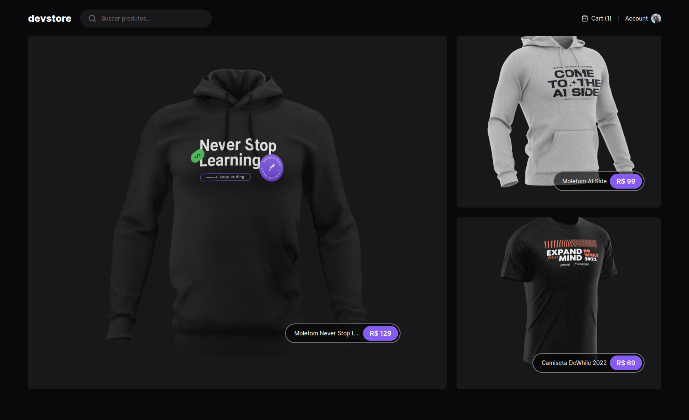
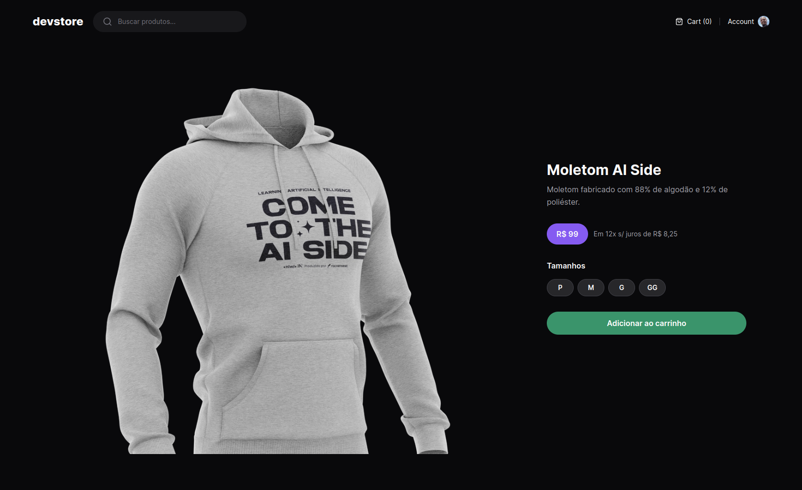

# DevStore

DevStore is a sample store built with Next.js, Tailwind CSS, and TypeScript.

With CI/CD automation for end-to-end testing using Cypress, and a production-ready deployment to Vercel.

## Screenshots





## Getting Started

```bash
# clone the repo
git clone https://github.com/rcmonteiro/devstore.git

# install dependencies
cd devstore
pnpm install

# create .env file
cp .env.sample .env

# run dev
pnpm run dev
```